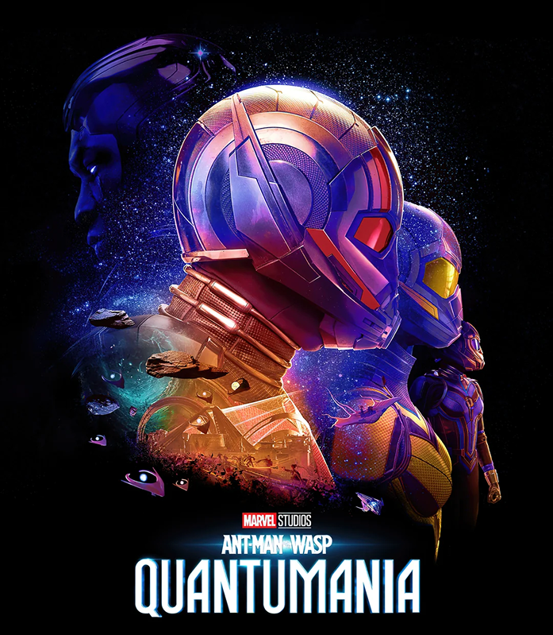

# *Ant-Man and The Wasp: Quantumania*

Atividade de *landing page* inspirada em um *design* feito no *Figma* — [clique aqui](https://www.figma.com/design/DtSzvcG0MhIP2usA5UYbQ1/Prot%C3%B3tipo-Figma?node-id=0-1&t=xk62DgzLQ4KXdz8d-1) para ver o projeto.

## Minha opinião sobre a produção da atividade

Antes de começar a codificar, eu estava bem ansioso, pois achei a atividade muito livre. No dia em que iniciei, quando vi o primeiro `header`, comecei a me desesperar e a desanimar. Então, olhei novamente o meu projeto no *Figma* e percebi que era possível separar o `header` em duas partes (`header-up` e `header-down`), como eu fiz.
Quando percebi, já tinha conseguido fazer todo o `header` e notei que foi bem fácil — meu desespero foi apenas momentâneo.

Depois disso, comecei o `main` de forma tranquila. Percebi que as `div`'s são simples, mas exigem atenção para entendê-las. A formatação com o `CSS` foi bem interessante, pois foi quando aprendi a usar o `position: absolute;` e o `transform: translate(x, y);`.

O `footer` foi a parte mais fácil da *landing page*, pois só tinha um carrossel e, como tudo era apenas visual, sem precisar ser funcional, foi bem simples de fazer.

A parte de formatar o *layout* para o *tablet (iPad Mini)* e para o *mobile (iPhone SE)* foi uma das mais interessantes, pois era algo que eu nunca imaginaria que fosse feito diretamente no próprio `CSS`.

Por fim, escrever este texto em um *[README.md](https://www.makeareadme.com/)* está sendo muito divertido, por mostrar funcionalidades de texto diferentes das convencionais.

Agradeço ao professor **Fernando Leonid** e à instituição do **SENAI Jandira**.